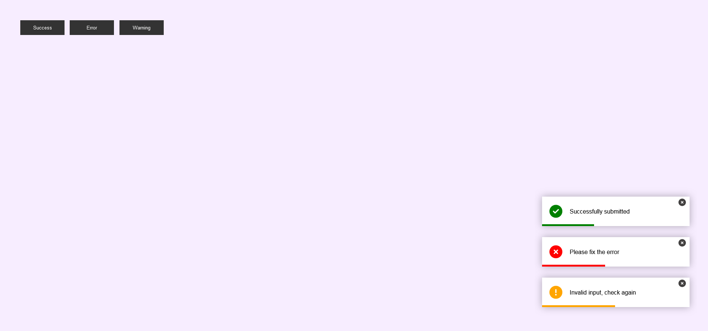

# Toast Notification

A simple and customizable toast notification project built with HTML5, CSS3, and JavaScript. This project demonstrates how to create toast notifications for success, error, and warning messages that can be displayed at the bottom right corner of the screen.

## Features

- **Different Notification Types:** Supports success, error, and warning notifications.
- **Auto-dismiss:** Notifications will automatically fade out after a specified duration.
- **Manual Dismiss:** Users can also manually close notifications using the close icon.

## Preview



## Getting Started

### Prerequisites

- A modern web browser that supports ES6 JavaScript.

### Installation

1. Clone the repository or download the ZIP file.
2. Open the `index.html` file in your web browser.

### Usage

- Click on the "Success", "Error", or "Warning" buttons to display the corresponding toast notification.

## Code Overview

### HTML Structure

The HTML file contains the structure for buttons to trigger notifications and a container for the toast messages.

```html
<!DOCTYPE html>
<html lang="en">
<head>
    <meta charset="UTF-8">
    <meta name="viewport" content="width=device-width, initial-scale=1.0">
    <title>Toast Notification</title>
    <link rel="stylesheet" href="style.css">
    <link rel="stylesheet" href="https://cdnjs.cloudflare.com/ajax/libs/font-awesome/6.6.0/css/all.min.css">
</head>
<body>
    <div class="buttons">
        <button class="toast-success">Success</button>
        <button class="toast-error">Error</button>
        <button class="toast-warn">Warning</button>
    </div>
    <div id="toastBox"></div>

    <script src="script.js"></script>
</body>
</html>
